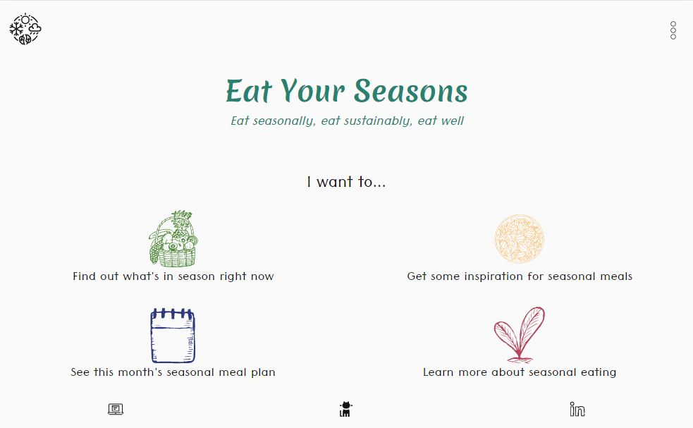
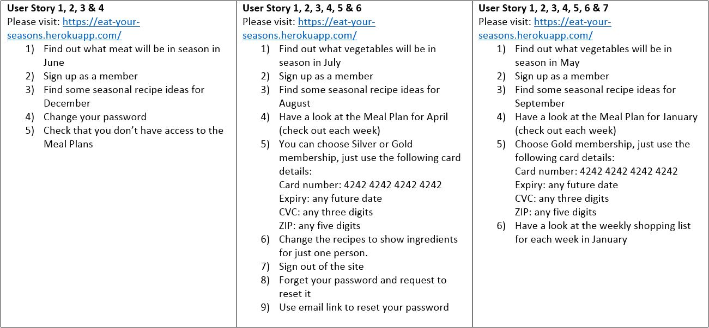

# Eat Your Seasons

:carrot:**Welcome to Eat Your Seasons**:green_apple:\
*Eat seasonally, eat sustainably, eat well*

Eat Your Seasons is a site aimed at those wanting to live a more sustainable lifestyle in order to help prevent further, catastrophic climate change. Improving our diet and eating more whole (in season!) foods is a fairly simple step that we can all make - this site makes that step even easier with seasonal food lists, meal suggestions, weekly meal plans and customisable shopping lists.

## Contents

[:sparkles: UX](#sparkles-ux)\
\
              [:books: User Stories](#books-user-stories)\
\
              [:earth_africa: Scope Plane](#earth_africa-scope-plane)\
\
              [:rainbow: Surface Plane/Design Choices](#rainbow-surface-planedesign-choices)\
\
              [:clipboard: Wireframes](#clipboard-wireframes)\
\
              [:dvd: Database Design](#dvd-database-design)\
\
              [:crystal_ball: Future Developments](#crystal_ball-future-developments)\
\
[:construction: Development Process](#construction-development-process)\
\
              [:unlock: Technologies Used](#unlock-technologies-used)\
\
              [:computer: External Sources Used](#computer-external-sources-used)\
\
              [:bug: Bugs](#bug-bugs)\
\
              [:broom: Refactoring](#broom-refactoring)\
\
              [:deciduous_tree: Branches](#deciduous_tree-branches)\
\
[:test_tube: Testing](#test_tube-testing)\
\
              [:people_holding_hands: Peer Tests](#people_holding_hands-peer-tests)\
\
              [:memo: Manual Tests](#memo-manual-tests)\
\
              [:heavy_check_mark: Online Validators](#heavy_check_mark-online-validators)\
\
              [:rotating_light: Lighthouse Tests](#rotating_light-lighthouse-tests)\
\
[:flight_departure: Deployment](#flight_departure-deployment)\
\
[:clapper: Credits](#clapper-credits)\
\
              [:teacher: Tutorials](#teacher-tutorials)\
\
              [:movie_camera: Media](#movie_camera-media)\
\
              [:trophy: Acknowledgements](#trophy-acknowledgements)

## :sparkles: UX

This project was inspired by the efforts my family and I are currently making to live more sustainably. After lots of research and experimentation with our dietary habits, we decided that the most environmentally-conscious diet for a family like ours is one that focuses heavily on shopping locally and seasonally.

There are various sites available that give information on eating seasonally, but not one that fully supports a switch to whole, seasonal foods. For a busy family who don't always have the time to research, it helps to answer:

* What's in season? 
* What meals can I cook with those ingredients?
* What do I need to buy and from where?

The site also offers varying levels of membership, from free content for casual site visitors, to lifetime membership for those fully committed to a seasonal diet.

### :books: User Stories

| User Story ID      | As a... | I want to be able to...      | So that I can...      |
| ------------------ | ---------- | ---------------------------- | --------------------- |
| 1      | site visitor       | see which foods are currently in season      | make informed choices when doing my shopping      |
| 2   | site visitor        | read suggestions on how to shop more sustainably   | make changes to my own shopping habits   |
| 3      | site visitor | get inspiration for meals using seasonal produce      | get an idea of how to eat more sustainably      |
| 4    | site member       | see recipes for meal suggestions | eat more sustainably without having to do additional reseach |
| 5    | paying member  | see weekly, seasonal meal plans   | eat sustainably with less work! |
| 6    | paying member  | change the number of people a meal serves in a recipe   | avoid food waste by only buying as much as I need |
| 7   | paying member  | see a weekly shopping list for my meal plan    | get the ingredients I need, easily |         

### :earth_africa: Scope Plane
---
:loop: **Site Logic**\
**Membership plan types**

| Plan type    | Monthly Price | Yearly Price      | 
| ------------------ | ---------- | ---------------------------- | 
| Site visitor     | N/A       | N/A      |
| Site member - Bronze     | £0       | £0       |
| Site member - Silver     | £3.99       | £40.00       |
| Site member - Gold     | £5.99       | £50.00       |


**Site access**

| Feature    | Visitor Access | Bronze member Access      | Silver member Access      |Gold member Access      | Admin Access      |
| ------------------ | ---------- | ---------------------------- | --------------------- |--------------------- | --------------------- |
Seasonal items | :heavy_check_mark: | :heavy_check_mark: | :heavy_check_mark: | :heavy_check_mark: | :heavy_check_mark: |
Meal suggestions | :heavy_check_mark: | :heavy_check_mark: | :heavy_check_mark: | :heavy_check_mark: | :heavy_check_mark: |
Recipes | :x: | :heavy_check_mark: | :heavy_check_mark: | :heavy_check_mark: | :heavy_check_mark: |
Meal plans | :x: | :x: | :heavy_check_mark: | :heavy_check_mark: | :heavy_check_mark: |
Shopping lists | :x: | :x: | :x: | :heavy_check_mark: | :heavy_check_mark: |
Dashboard management | :x: | :x: | :x: | :x: | :heavy_check_mark: |

### :rainbow: Surface Plane/Design Choices
---
:pencil2: **Font families**

Tenali Ramakrishna and Merienda One

[Merienda One](https://fonts.google.com/specimen/Merienda+One?preview.text_type=custom) was chosen for main headings as I feel it reflects the natural theme of the site.


[Tenali Ramakrishna](https://fonts.google.com/specimen/Tenali+Ramakrishna?preview.text_type=custom) was chosen for all other text as it is clean-looking and legible at all sizes.


:art: **Colour choices**

The site was built around a different colour theme for each month, to highlight the key aspect of seasonality. 

The monthly colours were taken from the article on [this site](https://www.womenshealthmag.com/life/a28447752/birthday-colors-colorstrology/) about 'birthday colours'. As the site has a light and dark theme, each colour was checked using 
the tonal colour tool on [this site](https://material.io/design/color/the-color-system.html#tools-for-picking-colors
). A tonal value of 200 was chosen for colours appearing in the dark theme, and 700 for colours appearing in the light theme. 

Background colours and fonts were kept neutral to avoid clashing with the theme colours, and to ensure good legibility of text.


### :clipboard: Wireframes
---
The site was designed with a mobile-first approach. 

[Wireframe document can be seen here](/wireframes/wireframe.pdf)

:bulb: **Deviation from wireframe**

* **Ability to change individual recipe quantities in Plan**\
Originally, I had planned to allow users to change the quantity (i.e. the number of people a recipe was for) for each recipe in the meal plan.
However, during development I made the decision to just change the option for the week as it looked cleaner on the page, and was less fussy for the user.

* **Dashboard Management page**\
I also included a page to allow an admin user to manage the dashboard page and add/edit/delete seasonal items without needing to access the backend of the database.

* **Navbar**\
In the wireframe, I had planned to have the naviation options across the top on all devices. However, I wanted each page to be as uncluttered as possible to allow the user
to focus on the content. Therefore, I opted to use a triple-dot icon in place of the menu that would open the menu in full when hovered over (or clicked on mobile devices).

### :dvd: Database Design
---

During development of the site, SQLite Database was used.
After deployment to Heroku, PostgreSQL was used.

Several separate databases were implemented, as follows:

#### Dashboard App
##### Category Model
| Field    | DB Key | Validation      | Relationship      | Data type      |
| ------------------ | ---------- | ---------------------------- | --------------------- |--------------------- |
Name | name | max_length=254 | N/A | CharField |
Friendly name | friendly_name | max_length=254 | N/A | CharField |


##### Month Model
| Field    | DB Key | Validation      | Relationship      | Data type      |
| ------------------ | ---------- | ---------------------------- | --------------------- |--------------------- |
Name | name | max_length=254 | N/A | CharField |

##### Item Model
| Field    | DB Key | Validation      | Relationship      | Data type      |
| ------------------ | ---------- | ---------------------------- | --------------------- |--------------------- |
Category | category | null=True, blank=True, on_delete=models.SET_NULL | ForeignKey to 'Category' | N/A |
Month | month | N/A | ManyToManyField to 'Month' | CharField |
Name | name | max_length=254 | N/A | CharField |

#### Recipes App
##### Category Model
| Field    | DB Key | Validation      | Relationship      | Data type      |
| ------------------ | ---------- | ---------------------------- | --------------------- |--------------------- |
Name | name | max_length=254 | N/A | CharField |
Friendly name | friendly_name | max_length=254 | N/A | CharField |


##### Month Model
| Field    | DB Key | Validation      | Relationship      | Data type      |
| ------------------ | ---------- | ---------------------------- | --------------------- |--------------------- |
Name | name | max_length=254 | N/A | CharField |


##### Step Model
| Field    | DB Key | Validation      | Relationship      | Data type      |
| ------------------ | ---------- | ---------------------------- | --------------------- |--------------------- |
Name | name | max_length=254 | N/A | CharField |


##### Ingredient Model
| Field    | DB Key | Validation      | Relationship      | Data type      |
| ------------------ | ---------- | ---------------------------- | --------------------- |--------------------- |
Name | name | max_length=254 | N/A | CharField |


##### Recipe Model
| Field    | DB Key | Validation      | Relationship      | Data type      |
| ------------------ | ---------- | ---------------------------- | --------------------- |--------------------- |
Category | category | null=True, blank=True, on_delete=models.SET_NULL | ForeignKey to 'Category' | N/A |
Month | month | N/A | ManyToManyField to 'Month' | CharField |
Name | name | max_length=254 | N/A | CharField |
Notes | notes | max_length=254 | N/A | CharField |
Image | image | max_length=254 | N/A | CharField |
Is Frozen | isfrozen | max_length=254 | N/A | CharField |
Ingredients | ingredients | N/A | ManyToManyField to 'Ingredient' through 'Quantity' | N/A |
Steps | steps | N/A | ManyToManyField to 'Step' | N/A |

#### Plan App
##### Day Model
| Field    | DB Key | Validation      | Relationship      | Data type      |
| ------------------ | ---------- | ---------------------------- | --------------------- |--------------------- |
Name | name | max_length=254 | N/A | CharField |
Friendly name | friendly_name | max_length=254 | N/A | CharField |

##### Week Model
| Field    | DB Key | Validation      | Relationship      | Data type      |
| ------------------ | ---------- | ---------------------------- | --------------------- |--------------------- |
Name | name | max_length=254 | N/A | CharField |
Friendly name | friendly_name | max_length=254 | N/A | CharField |

##### Plan Model
| Field    | DB Key | Validation      | Relationship      | Data type      |
| ------------------ | ---------- | ---------------------------- | --------------------- |--------------------- |
Day | day | null=True, blank=True, on_delete=models.SET_NULL | ForeignKey to 'Day' | N/A |
Week | week | null=True, blank=True, on_delete=models.SET_NULL | ForeignKey to 'Week' | N/A |
Month | month | null=True, blank=True, on_delete=models.SET_NULL | ForeignKey to 'recipes.Month' | N/A |
Recipe | recipe | null=True, blank=True, on_delete=models.SET_NULL | ForeignKey to 'recipes.Recipe' | N/A |
Batch Cook | batch_cook | max_length=254 | N/A | CharField |

#### Membership App
##### User Model
| Field    | DB Key | Validation      | Relationship      | Data type      |
| ------------------ | ---------- | ---------------------------- | --------------------- |--------------------- |
Customer | customer | null=True, blank=True, on_delete=models.SET_NULL | ForeignKey to 'djstripe.Customer' | N/A |
Subscription | subscription | null=True, blank=True, on_delete=models.SET_NULL | ForeignKey to 'djstripe.Subscription' | N/A |

### dj-stripe
*dj-stripe is a plugin that implements all of the Stripe models for Django*\
Models from dj-stripe were also used including:
* Customers
Details about the customer, linked to the data on sign up in Django Allauth

* Subscriptions
Linking the customer to the Products, Plans & Prices models

* Products
Details about the subscription product, taken directly from Stripe

* Plans
Details about the plan (i.e. monthly or annual payment) taken directly from Stripe

* Prices
Details about the prices for each plan, taken directly from Stripe


### :crystal_ball: Future Developments
---

There are several features that I would like to have the opportunity to develop in the future given more time:

* Bookmark recipes\
This feature would allow users to save favourite recipes to their profile in order to easily find them again at a later date.

* Share own recipes\
I would like to give the site more of a community-feel, so that users can contribute their own seasonal recipes, based around the items from the 'What's in season' dashboard.

* Create own weekly meal plan\
Following the implementation of the above feature, users would be able to select seasonal recipes from the site and the community to create a personalised weekly meal plan.

* Collate ingredients in the shopping list\
Currently, the ingredients in the shopping list are listed as they are pulled through from each individual recipes. So, you might see:
    * 40g chopped onions
    * 30g chopped onions
being pulled through from two separate recipes.\

    In future, I would like to add functionality to collate these ingredients so that it shows:
    * 70g chopped onions

* Change subscription type\
Whilst functionality to cancel a subscription has been implemented, it would be useful in future to allow users to upgrade or downgrade their subscription
type.

* Extend management pages\
Currently, there is functionality for an admin user to manage the dashboard page and add/edit/delete seasonal items. In future, it would be nice to extend this to further areas of the website to allow for additional updates to recipes without the need to access the backend of the database.

## :construction: Development Process

### :unlock: Technologies Used
---
**Languages**
* [CSS](https://developer.mozilla.org/en-US/docs/Web/CSS)
* [HTML](https://developer.mozilla.org/en-US/docs/Web/HTML)
* [JavaScript](https://developer.mozilla.org/en-US/docs/Web/JavaScript)
* [Python](https://www.python.org/)

**Libraries & Frameworks**
* [Bootstrap](https://getbootstrap.com/)
* [Django](https://www.djangoproject.com/)
* [Django Allauth](https://django-allauth.readthedocs.io/en/latest/installation.html)
* [Django Crispy Forms](https://django-crispy-forms.readthedocs.io/en/latest/)
* [dj-stripe](https://dj-stripe.readthedocs.io/en/master/#:~:text=Stripe%20Made%20Easy-,Introduction,soon%20as%20they%20are%20updated!)
* [Google Fonts](https://fonts.google.com/)
* [Gunicorn](https://pypi.org/project/gunicorn/)
* [jQuery](https://jquery.com/)
* [NeedPix](https://www.needpix.com/)
* [Noun Project](https://thenounproject.com/)
* [pip](https://pip.pypa.io/en/stable/)
* [Popper](https://popper.js.org/)
* [Psycopg2](https://pypi.org/project/psycopg2/)
* [Stripe](https://stripe.com/)

**Tools**
* [Favicon.io](https://favicon.io/)
* [GitHub](https://github.com/)
* [Gitpod](https://gitpod.io/)
* [Heroku](https://heroku.com/)
* [Hover.css](https://ianlunn.github.io/Hover/)
* [Gimp](https://www.gimp.org/)


### :bug: Bugs
---

#### Django password validator error
After amending my code to conform to pep8 standards, I found that the Django password validator no longer worked.\
The fix was simply to revert the code back to how it had been, ignoring the pep8 error!

**Original code**
```
AUTH_PASSWORD_VALIDATORS = [
    {
        'NAME': 'django.contrib.auth.password_validation.\
        UserAttributeSimilarityValidator',
    },
    {
        'NAME': 'django.contrib.auth.password_validation.\
        MinimumLengthValidator',
    },
    {
        'NAME': 'django.contrib.auth.password_validation.\
        CommonPasswordValidator',
    },
    {
        'NAME': 'django.contrib.auth.password_validation.\
        NumericPasswordValidator',
    },
]
```

**Modified code**
```
AUTH_PASSWORD_VALIDATORS = [
    {
        'NAME': 'django.contrib.auth.password_validation.UserAttributeSimilarityValidator',
    },
    {
        'NAME': 'django.contrib.auth.password_validation.MinimumLengthValidator',
    },
    {
        'NAME': 'django.contrib.auth.password_validation.CommonPasswordValidator',
    },
    {
        'NAME': 'django.contrib.auth.password_validation.NumericPasswordValidator',
    },
]
```

Aside from this bug, there were a couple of issues that required a lot of work to fix which I will outline here.

* Getting the subscription model to work took a lot of time and a lot of research. In the end, I was able to get it working using a tutorial I found on
[Ordinary Coders](https://www.ordinarycoders.com/blog/article/django-stripe-monthly-subscription). This made use of dj-stripe. In hindsight, it might have been
more straightforward to set up my own webhooks and pull everything in directly from Stripe, but I am pleased that I at least got it working in the end, and it is something 
I will revisit in the future.

* Another consideration I had was where to store my svg icons. In theory, they should be stored as static files, however, I wanted to be able to use 'include' from Django templating.
After reading through an [article](https://css-tricks.com/using-svg/) on svg practices, I was convinced that keeping them in the template folder was the right path for my project.

* A final issue that has not yet been fixed occurs when changing month using the month header on the dashboard, recipe and plan pages. When clicking on a month, before the page reloads with
the selected month, the button itself momentarily disappears. This is only a minor issue as functionality isn't affected, but is something I would like to fix in future.

### :broom: Refactoring
---

:warning: The main amends I had to make to my code was in relation to my secret keys. :warning:

In my endeavours to get the subscription model working, I inadvertently pushed my Stripe keys through to my repository unhidden.
Once I realised this, I simply rolled over the Stripe keys to create new ones, and made sure that these were kept hidden in my env.py file.\
Obviously this was quite a significant mistake to make, but something I have learnt from and hopefully something I won't do again!

## :test_tube: Testing  

### :people_holding_hands: Peer Tests
---

I enlisted the help of three family members to test each of the user stories.



There was some feedback relating to personal preferences of image styles and colour choices, however no issues were found with the
actual ease of use or functionality of the site. Therefore, I am happy that these tests were all passed without any need for amendments.

### :memo: Manual Tests
---
Manual testing was carried out on all devices available to me:
* Google Dev Tools:
    * Mobile device
    * iPad vertical
    * iPad horizontal
    * Desktop

* Published site:
    * Samsung Galaxy S8
    * Desktop

* Browser
    * Chrome
    * Edge
    * Firefox
    * Safari (Using [Lambdatest](https://www.lambdatest.com/))
    * Opera 

There were no issues found in any of the tests, and the site renders well on all devices. All user stories were satisfied by the Peer and Manual tests.

The full testing frame can be found [here](testing/testing-frame.pdf).

### :heavy_check_mark: Online Validators
---

#### [JSHint](https://jshint.com/)

The [script.js](/static/js/script.js) file was run through [JSHint.com](https://jshint.com/).

The only issues shown were some missing semicolons which have now been rectified.

#### [W3C CSS Validator](http://jigsaw.w3.org/css-validator/)

The [base.css](/static/css/base.css) file was run through [W3C CSS Validator](http://jigsaw.w3.org/css-validator/).

There were no errors within the document and the only warnings were regarding the use of variables (for example: "--fish-active is an unknown vendor extension"), which can be ignored.

#### [W3C Markup Validation Service](https://validator.w3.org/)

Due to the use of Django templating language across the site, it was not possible to copy the code from each internal file to use as direct input on the [W3C Markup Validation Service](https://validator.w3.org/).

Because the site is largely hidden from unregistered users, I also couldn't check via URI.

Therefore, I used the source code shown in Google Dev Tools for direct input. 

TBC

### :rotating_light: Lighthouse Tests
---

TBC

## :flight_departure: Deployment 

The project was created in Gitpod and can be run locally using the following instructions:

### Local Deployment

1. Create a Stripe account and create the appropriate Products and Plans within the dashboard

2. Clone a copy of this repository, entering the following into the Gitpod CLI:\
``
gh repo clone jess-bennett/eat-your-seasons
``

3. Install all requirements from the requirements.txt file with:\
``
python3 -m pip install -r requirements.txt
``

4. Create an env.py file. This needs to contain the following variables:

* os.environ["SECRET_KEY"] = Your secret Django key
* os.environ["STRIPE_TEST_PUBLIC_KEY"] = Public key obtained from Stripe
* os.environ["STRIPE_TEST_SECRET_KEY"] = Secret key obtained from Stripe
* os.environ["DEVELOPMENT"] = '1'

5. Migrate all models with:\
``
python3 manage.py migrate
``

6. Create a super user with:\
``
python3 manage.py createsuperuser
``

7. Load each fixture using:\
``
python3 manage.py loaddata <fixture_name>
``

8. Run the project using:\
``
python3 manage.py runserver
``

### Deployment to Heroku

1. Create a requirements.txt file:\
``
pip freeze > requirements.txt
``

2. Create a Procfile with the following CLI command:\
``
echo web: python3 app.py > Procfile
``

3. Add, Commit and Push to GitHub

4. Create a new project in Heroku

5. Within the Heroku dashboard, select to Deploy via GitHub

6. Add the following under Config Vars:

##### Plan Model
| Key    | Value | 
| -------- | ------ | 
| AWS_ACCESS_KEY_ID | ------ | 
| AWS_SECRET_ACCESS_KEY | ------ | 
| DATABASE_URL | ------ | 
| EMAIL_HOST_PASS | ------ | 
| EMAIL_HOST_USER | ------ | 
| SECRET_KEY | ------ | 
| STRIPE_TEST_PUBLIC_KEY | ------ | 
| STRIPE_TEST_SECRET_KEY | ------ | 
| USE_AWS | True | 

7. Set up the Heroku Postgres add-on using Hobby Dev - free

8. Migrate all models to the Postgres database using the following CLI commands:\
``
python3 manage.py makemigrations
``

``
python3 manage.py migrate
``

9. Load each fixture using:\
``
python3 manage.py loaddata <fixture_name>
``

10. Create a super user with:\
``
python3 manage.py createsuperuser
``

11. Push your code to GitHub - if automatic deployment has been setup, this will run the app on Heroku pages.

## :clapper: Credits

### :teacher: Tutorials
--- 

### :movie_camera: Media
---

### :trophy: Acknowledgements
---